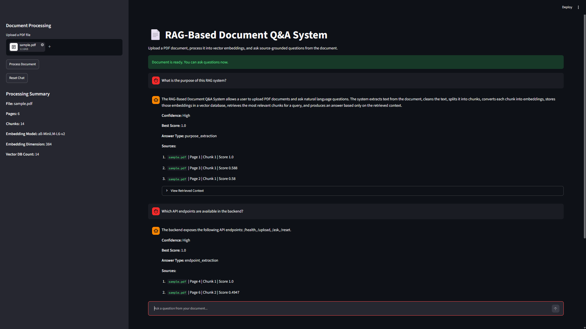
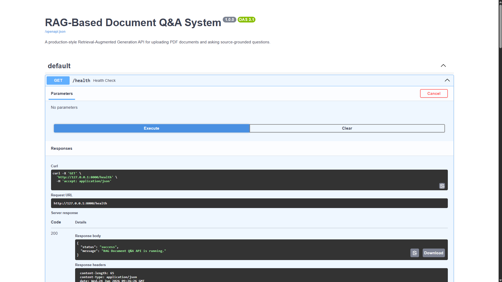
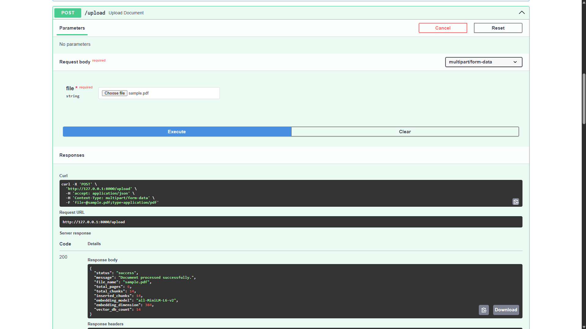
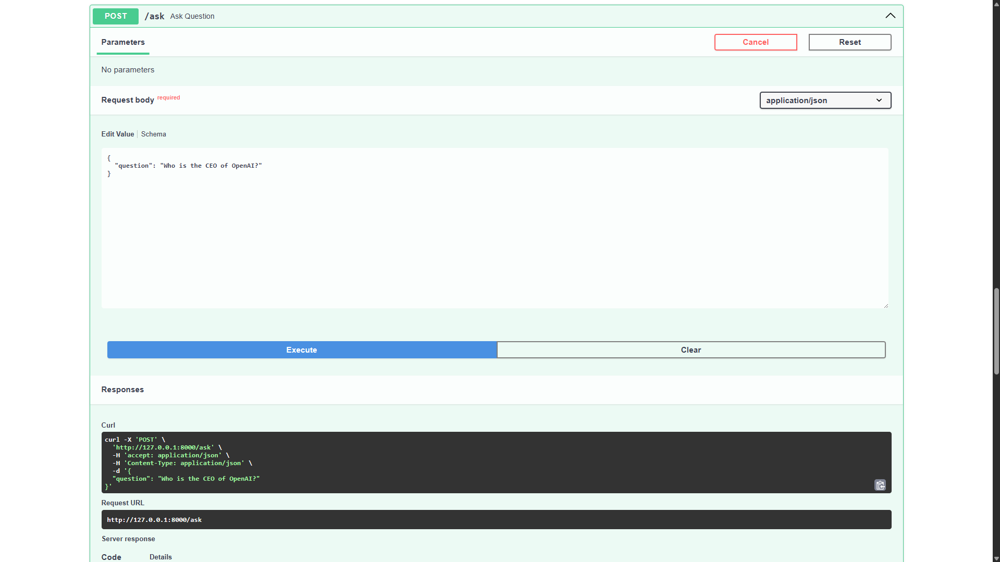

# RAG-Based Document Q&A System

A production-style **Retrieval-Augmented Generation document question-answering system** that allows users to upload PDF documents and ask source-grounded questions from the uploaded content.

This project demonstrates practical skills in **Python engineering, NLP, embeddings, vector databases, semantic search, re-ranking, FastAPI backend development, Streamlit frontend development, testing, Docker, and CI/CD**.

---

## Project Highlights

* Built an end-to-end RAG pipeline for PDF-based question answering
* Extracted text from PDF documents with page-level metadata
* Implemented text cleaning and metadata-aware chunking
* Generated embeddings using Sentence Transformers
* Stored and searched document chunks using ChromaDB
* Added Cross-Encoder re-ranking to improve retrieval quality
* Generated grounded answers using retrieved context
* Added fallback handling when the answer is not present in the document
* Built a Streamlit chat interface for document Q&A
* Built a FastAPI backend with upload, ask, health, and reset endpoints
* Added pytest test cases for core modules
* Added Docker support and GitHub Actions CI workflow

---

## Tech Stack

| Area               | Tools                 |
| ------------------ | --------------------- |
| Language           | Python                |
| PDF Parsing        | pypdf                 |
| Embeddings         | Sentence Transformers |
| Vector Database    | ChromaDB              |
| Re-ranking         | Cross-Encoder         |
| Backend API        | FastAPI               |
| Frontend UI        | Streamlit             |
| Testing            | pytest                |
| Deployment Support | Docker                |
| CI/CD              | GitHub Actions        |
| Version Control    | Git, GitHub           |

---

## System Architecture

```text
PDF Upload
   ↓
Document Loader
   ↓
Text Cleaner
   ↓
Metadata-Aware Chunking
   ↓
Sentence Transformer Embeddings
   ↓
ChromaDB Vector Store
   ↓
Vector Retriever
   ↓
Cross-Encoder Re-ranker
   ↓
Grounded Answer Generator
   ↓
Answer + Confidence + Sources
```

---

## How It Works

### 1. PDF Ingestion

The uploaded PDF is processed page by page. Each page stores:

```text
file_name
page_number
text
character_count
```

### 2. Text Cleaning

The extracted text is cleaned by removing extra spaces, repeated line breaks, and common PDF extraction artifacts.

### 3. Chunking

The cleaned text is split into overlapping chunks. Each chunk keeps metadata such as:

```text
file name
page number
chunk number
word count
character count
```

### 4. Embedding Generation

Each chunk is converted into a dense vector embedding using Sentence Transformers.

### 5. Vector Search

The embeddings are stored in ChromaDB. When the user asks a question, the question is also embedded and compared with stored document chunks.

### 6. Re-ranking

The top retrieved chunks are passed through a Cross-Encoder re-ranker to improve relevance before answer generation.

### 7. Grounded Answer Generation

The final answer is generated only from the retrieved context. If the answer is not found in the document, the system returns a fallback response.

---

## Features

* PDF upload and processing
* Page-level text extraction
* Text cleaning pipeline
* Metadata-aware chunking
* Embedding generation
* ChromaDB vector storage
* Semantic search
* Cross-Encoder re-ranking
* Grounded answer generation
* Confidence scoring
* Source citation with page and chunk number
* Fallback response for unavailable answers
* Streamlit frontend
* FastAPI backend
* Pytest test suite
* Dockerfile
* GitHub Actions workflow

---

## Folder Structure

```text
RAG-Document-QNA-System/
│
├── app/
│   ├── __init__.py
│   ├── main.py
│   ├── routes.py
│   └── schemas.py
│
├── src/
│   ├── __init__.py
│   ├── config.py
│   ├── document_loader.py
│   ├── embeddings.py
│   ├── ingestion_pipeline.py
│   ├── llm.py
│   ├── logger.py
│   ├── prompt_builder.py
│   ├── rag_pipeline.py
│   ├── reranker.py
│   ├── retriever.py
│   ├── text_cleaner.py
│   ├── text_splitter.py
│   └── vector_store.py
│
├── streamlit_app/
│   └── app.py
│
├── data/
│   ├── sample_docs/
│   │   └── sample.pdf
│   └── uploaded_docs/
│       └── .gitkeep
│
├── tests/
│   ├── test_api.py
│   ├── test_document_loader.py
│   ├── test_rag_pipeline.py
│   ├── test_text_cleaner.py
│   ├── test_text_splitter.py
│   └── test_vector_store.py
│
├── scripts/
│   ├── preview_chunking.py
│   ├── preview_embeddings.py
│   ├── preview_pdf_loader.py
│   ├── preview_rag_pipeline.py
│   ├── preview_retriever.py
│   ├── preview_vector_store.py
│   └── run_ingestion_pipeline.py
│
├── screenshots/
├── notebooks/
├── .github/
│   └── workflows/
│       └── ci.yml
│
├── Dockerfile
├── README.md
├── requirements.txt
├── pytest.ini
├── .gitignore
├── .gitattributes
└── .env.example
```

---

## Installation

Clone the repository:

```bash
git clone https://github.com/darshhhhhh/RAG-Document-QNA-System.git
cd RAG-Document-QNA-System
```

Create a virtual environment:

```bash
python -m venv venv
```

Activate the virtual environment on Windows:

```bash
venv\Scripts\activate
```

Install dependencies:

```bash
pip install -r requirements.txt
```

---

## Run the Streamlit App

```bash
streamlit run streamlit_app/app.py
```

Then:

1. Upload a PDF document
2. Click **Process Document**
3. Ask questions from the uploaded PDF
4. View answer, confidence score, sources, and retrieved context

---

## Run the FastAPI Backend

```bash
uvicorn app.main:app --reload
```

Open the API documentation:

```text
http://127.0.0.1:8000/docs
```

---

## API Endpoints

| Method | Endpoint  | Description                                |
| ------ | --------- | ------------------------------------------ |
| GET    | `/health` | Check API health                           |
| POST   | `/upload` | Upload and process a PDF                   |
| POST   | `/ask`    | Ask a question from the processed document |
| DELETE | `/reset`  | Reset the vector database                  |

---

## Example API Request

### POST `/ask`

Request:

```json
{
  "question": "Which API endpoints are available in the backend?"
}
```

Response:

```json
{
  "question": "Which API endpoints are available in the backend?",
  "answer": "The backend exposes the following API endpoints: /health, /upload, /ask, /reset.",
  "confidence": "High",
  "best_score": 1.0,
  "answer_type": "endpoint_extraction",
  "sources": [
    {
      "file_name": "sample.pdf",
      "page_number": 4,
      "chunk_number": 1,
      "chunk_id": "sample_page_4_chunk_1",
      "score": 1.0
    }
  ]
}
```

---

## Sample Questions and Outputs

### Question 1

```text
What is the purpose of this RAG system?
```

Expected answer:

```text
The RAG-Based Document Q&A System allows a user to upload PDF documents and ask natural language questions. The system extracts text from the document, cleans the text, splits it into chunks, converts each chunk into embeddings, stores those embeddings in a vector database, retrieves the most relevant chunks for a query, and produces an answer based only on the retrieved context.
```

### Question 2

```text
Which API endpoints are available in the backend?
```

Expected answer:

```text
The backend exposes the following API endpoints: /health, /upload, /ask, /reset.
```

### Question 3

```text
Who is the CEO of OpenAI?
```

Expected answer:

```text
I could not find this information in the uploaded document.
```

This shows that the system does not hallucinate when the answer is not available in the document.

---

## Screenshots

Add screenshots inside the `screenshots/` folder and update these image paths.

### Streamlit Interface

```markdown

```

### FastAPI Health Endpoint

```markdown

```

### FastAPI Upload Endpoint

```markdown

```

### FastAPI Ask Endpoint

```markdown

```

---

## Run Tests

```bash
pytest
```

Expected output:

```text
7 passed
```

---

## Docker Usage

Build the Docker image:

```bash
docker build -t rag-document-qa .
```

Run the container:

```bash
docker run -p 8000:8000 rag-document-qa
```

Open:

```text
http://127.0.0.1:8000/docs
```

---

## Model Choices

### Embedding Model

```text
all-MiniLM-L6-v2
```

This model is lightweight and suitable for semantic search experiments. It generates 384-dimensional embeddings.

### Re-ranker Model

```text
cross-encoder/ms-marco-MiniLM-L-6-v2
```

The re-ranker improves retrieval quality by scoring the user question and retrieved chunks together.

### Vector Database

```text
ChromaDB
```

ChromaDB is used for persistent local vector storage and similarity search.

---

## Evaluation Approach

The project is evaluated using known questions and expected answer locations.

| Test Question                                     | Expected Source   |
| ------------------------------------------------- | ----------------- |
| What is the purpose of this RAG system?           | Page 1            |
| Which API endpoints are available in the backend? | Page 4            |
| What are the recommended evaluation metrics?      | Page 5            |
| What should happen when the answer is not found?  | Page 1 / Page 4   |
| Who is the CEO of OpenAI?                         | Fallback response |

The system is considered successful when it retrieves the correct source and avoids answering unsupported questions.

---

## What I Learned

* How to build an end-to-end RAG pipeline
* How to process PDFs with page-level metadata
* How to generate and store text embeddings
* How vector search works in document question answering
* Why re-ranking improves retrieval quality
* How to build a FastAPI backend for ML applications
* How to build a Streamlit UI for interactive ML demos
* How to add tests and CI workflow for a machine learning project
* How to structure a project for GitHub and resume presentation

---

## Limitations

* Works best with text-based PDFs
* Scanned PDFs are not supported yet
* Local answer generation is extractive and not as fluent as LLM-generated answers
* Currently processes one document at a time
* No user authentication
* No cloud deployment added yet

---

## Future Improvements

* Add Gemini or OpenAI for more natural answer generation
* Add multi-document support
* Add OCR for scanned PDFs
* Add PDF table extraction
* Add chat history export
* Add document management dashboard
* Add user authentication
* Deploy backend on Render, Railway, or Azure
* Deploy frontend on Streamlit Cloud
* Add retrieval evaluation metrics dashboard

---

## Author

**Darshil Vaja**